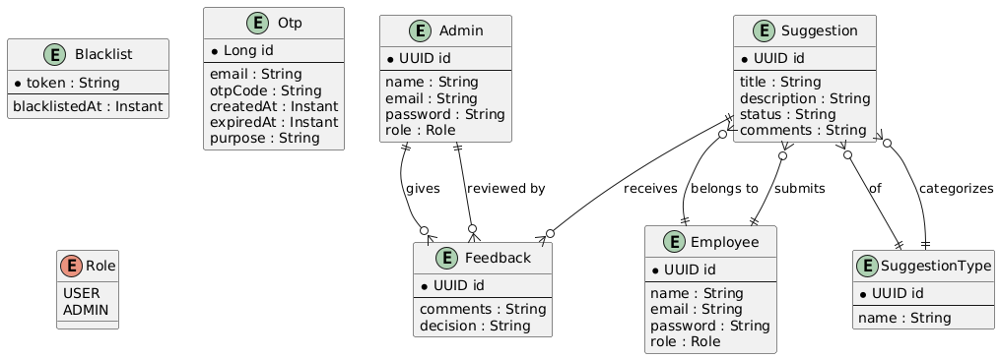

# eSuggestion System

A comprehensive employee suggestion management system built with Spring Boot backend and React frontend, featuring secure authentication, role-based access control, and real-time feedback mechanisms.




## Problem Description

The eSuggestion System addresses the critical need for organizations to establish a structured, transparent, and efficient mechanism for collecting, managing, and responding to employee suggestions. Traditional suggestion boxes and informal feedback channels often lack:

- **Accountability**: No tracking of suggestion status or management responses
- **Transparency**: Employees cannot see the progress of their suggestions
- **Categorization**: Lack of systematic organization of suggestions by type or priority
- **Feedback Loop**: No mechanism for management to provide feedback on suggestions
- **Security**: Inadequate protection of sensitive employee data and suggestions

This system provides a digital platform that transforms the suggestion process into a collaborative, trackable, and secure workflow that benefits both employees and management.

## Business Requirements

### Functional Requirements

1. **User Management**
   - Employee registration with email OTP verification
   - Employee login with OTP authentication
   - Admin user management with elevated privileges
   - Role-based access control (USER, ADMIN)
   - Password reset functionality with email verification

2. **Suggestion Management**
   - Create, read, update, and delete suggestions
   - Categorize suggestions by type (e.g., Process Improvement, Safety, Technology)
   - Track suggestion status (Pending, Under Review, Approved, Rejected, Implemented)
   - Pagination support for suggestion listing
   - Filter suggestions by status

3. **Feedback System**
   - Admins can provide feedback on employee suggestions
   - Track feedback decisions and comments
   - Historical tracking of all feedback interactions

4. **Dashboard & Analytics**
   - Separate dashboards for employees and admins
   - Employee count tracking
   - Suggestion management interface

### Quality Attributes

1. **Security**
   - JWT-based authentication
   - Password encryption using BCrypt
   - Role-based authorization
   - Token blacklisting for logout

2. **Performance**
   - Optimized database queries with JPA/Hibernate
   - Connection pooling for database operations
   - Efficient frontend rendering with React

3. **Scalability**
   - Microservices-ready architecture
   - Stateless authentication
   - Modular component design

4. **Usability**
   - Responsive web design
   - Intuitive user interface
   - Cross-device compatibility

5. **Reliability**
   - Error handling and validation
   - Data integrity constraints
   - Backup and recovery mechanisms

## Domain & Data Modeling

### Core Entities

The system is built around five primary entities:

1. **Employee** - System users who submit suggestions (with OTP authentication)
2. **Admin** - Administrative users who manage and respond to suggestions
3. **Suggestion** - The core business object containing employee ideas with status tracking
4. **SuggestionType** - Categories for organizing suggestions (e.g., Process Improvement, Safety, Technology)
5. **Feedback** - Responses from admins to employee suggestions with decision tracking

### Entity Relationships

- **Employee** ↔ **Suggestion**: One-to-Many (An employee can submit multiple suggestions)
- **Admin** ↔ **Feedback**: One-to-Many (An admin can provide multiple feedback responses)
- **Suggestion** ↔ **SuggestionType**: Many-to-One (Multiple suggestions can belong to one type)
- **Suggestion** ↔ **Feedback**: One-to-Many (A suggestion can receive multiple feedback responses)
- **Employee** ↔ **Suggestion**: Many-to-One (A suggestion belongs to one employee)

### Database Schema

The system uses MySQL as the relational database with the following key features:

- **Primary Keys**: UUID-based identifiers for all entities
- **Foreign Keys**: Proper referential integrity between related entities
- **Indexes**: Optimized queries on frequently accessed fields (email, status)
- **Constraints**: Data validation and business rule enforcement

### Supporting Entities

- **Role** - Enumeration defining user roles (USER, ADMIN)
- **Otp** - One-time password for authentication and password reset functionality
- **Blacklist** - JWT token blacklisting for secure logout
- **TokenBlacklist** - Repository for managing blacklisted JWT tokens

### Design Patterns

1. **MVC Pattern**: Separation of Model, View, and Controller responsibilities
2. **Repository Pattern**: Abstract data access layer
3. **DTO Pattern**: Data transfer objects for API communication
4. **Mapper Pattern**: Object transformation between layers
5. **Singleton Pattern**: Service layer implementations

### Security Architecture

- **Authentication**: JWT-based stateless authentication
- **Authorization**: Role-based access control (RBAC)
- **Password Security**: BCrypt encryption with configurable strength
- **Session Management**: Token-based with blacklisting support
- **Input Validation**: Comprehensive request validation and sanitization

## Technology Stack

### Backend
- **Framework**: Spring Boot 3.4.3
- **Language**: Java 17
- **Database**: MySQL 8.0
- **ORM**: Spring Data JPA with Hibernate
- **Security**: Spring Security with JWT
- **Build Tool**: Maven
- **Email**: Spring Mail with SMTP

### Frontend
- **Framework**: React 19.0.0
- **Build Tool**: Vite 6.3.1
- **UI Library**: Material-UI (MUI) 7.1.0
- **Styling**: Tailwind CSS 4.1.6
- **Routing**: React Router DOM 7.5.3
- **HTTP Client**: Axios 1.9.0
- **Charts**: Recharts 2.15.3

### Development Tools
- **IDE**: Compatible with IntelliJ IDEA, Eclipse, VS Code
- **Version Control**: Git
- **API Testing**: Postman or similar REST client
- **Database Management**: MySQL Workbench or phpMyAdmin

## Installation & Setup

### Prerequisites
- Java 17 or higher
- Node.js 18 or higher
- MySQL 8.0 or higher
- Maven 3.6 or higher

### Backend Setup

1. **Clone the repository**
   ```bash
   git clone <repository-url>
   cd eSuggestion-system-springboot-and-react
   ```

2. **Configure database**
   - Create MySQL database: `esuggestion_db`
   - Update `application.properties` with your database credentials

3. **Run the application**
   ```bash
   cd suggestion
   mvn spring-boot:run
   ```

### Frontend Setup

1. **Install dependencies**
   ```bash
   cd frontend/frontend
   npm install
   ```

2. **Start development server**
   ```bash
   npm run dev
   ```

3. **Build for production**
   ```bash
   npm run build
   ```

## API Documentation

### Employee Endpoints
- `POST /api/employees/create` - Employee registration
- `POST /api/employees/validateEmployeeRegister` - Validate registration OTP
- `POST /api/employees/login` - Employee login
- `POST /api/employees/validateEmployeeLogin` - Validate login OTP
- `POST /api/employees/logout` - Employee logout
- `POST /api/employees/reset` - Request password reset
- `POST /api/employees/validatePassword` - Validate password reset OTP
- `PUT /api/employees/updatePassword` - Update password
- `GET /api/employees/readEmployee` - Get all employees
- `GET /api/employees/readEmployeeById/{id}` - Get employee by ID
- `PUT /api/employees/changeEmployee/{id}` - Update employee
- `DELETE /api/employees/removeEmployeeById/{id}` - Delete employee

### Suggestion Endpoints
- `GET /api/suggestions/readSuggestion` - Get all suggestions
- `GET /api/suggestions/readSuggestionById/{id}` - Get suggestion by ID
- `GET /api/suggestions/status/{status}` - Get suggestions by status
- `GET /api/suggestions/paginate` - Get paginated suggestions
- `POST /api/suggestions/createSuggestion` - Create new suggestion
- `PUT /api/suggestions/changeSuggestion/{id}` - Update suggestion
- `DELETE /api/suggestions/removeSuggestionById/{id}` - Delete suggestion

### Admin Endpoints
- `GET /api/admins/readAdmin` - Get all admins
- `GET /api/admins/readAdminById/{id}` - Get admin by ID
- `POST /api/admins/createAdmin` - Create admin
- `PUT /api/admins/changeAdmin/{id}` - Update admin
- `DELETE /api/admins/removeAdminById/{id}` - Delete admin

### Feedback Endpoints
- `POST /api/feedback` - Create feedback
- `GET /api/feedback/suggestion/{suggestionId}` - Get feedback for suggestion

## Security Features

### Authentication & Authorization
- **JWT Tokens**: Secure, stateless authentication
- **Role-Based Access**: USER and ADMIN roles with appropriate permissions
- **Password Security**: BCrypt encryption with salt
- **Token Blacklisting**: Secure logout mechanism
- **CORS Configuration**: Cross-origin resource sharing setup
- **OTP Authentication**: Two-factor authentication using email OTP for login and registration
- **Password Reset**: Secure password reset flow with email verification

### Data Protection
- **Input Validation**: Comprehensive request validation
- **SQL Injection Prevention**: Parameterized queries via JPA
- **XSS Protection**: Content Security Policy headers
- **CSRF Protection**: Cross-site request forgery prevention

### Session Management
- **Stateless Design**: No server-side session storage
- **Token Expiration**: Configurable JWT expiration times
- **Secure Headers**: HTTP security headers implementation

## Performance Optimizations

### Backend Optimizations
- **Connection Pooling**: HikariCP for database connections
- **Query Optimization**: JPA/Hibernate query tuning
- **Caching**: Application-level caching strategies
- **Async Processing**: Non-blocking operations where appropriate

### Frontend Optimizations
- **Code Splitting**: Lazy loading of components
- **Bundle Optimization**: Vite build optimization
- **Image Optimization**: Compressed and optimized assets
- **Caching**: Browser caching strategies

### Database Optimizations
- **Indexing**: Strategic database indexes
- **Query Optimization**: Efficient SQL queries
- **Connection Management**: Optimized connection pooling

## Contributing

1. Fork the repository
2. Create a feature branch (`git checkout -b feature/amazing-feature`)
3. Commit your changes (`git commit -m 'Add some amazing feature'`)
4. Push to the branch (`git push origin feature/amazing-feature`)
5. Open a Pull Request

## License

This project is licensed under the MIT License - see the LICENSE file for details.

## Support

For support and questions, please contact the development team or create an issue in the repository. 